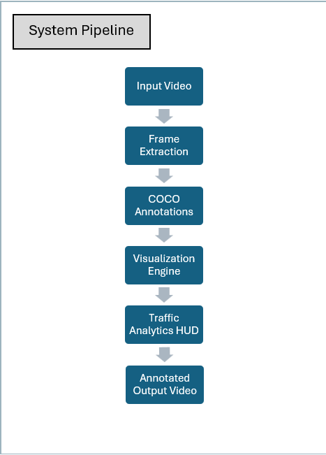

# Urban Traffic Monitoring Demo

## Overview

This project demonstrates a **computer vision pipeline for urban traffic monitoring** based on annotated video data.  
It visualizes detected and tracked objects and generates real-time traffic statistics using a custom HUD overlay.

The system processes frames annotated in **COCO format** and produces an output video containing:

- Bounding boxes for detected objects
- Object class labels
- Track IDs
- Lane IDs
- Traffic statistics dashboard (HUD)
- Timestamp overlay

The goal of the project is to simulate a **traffic analytics visualization system** similar to those used in smart city and intelligent transportation applications.

## Dataset

The project uses an annotated dataset consisting of extracted video frames from an urban traffic video recorded at a city intersection
and COCO-format annotations.

The original source video used for frame extraction is not included in this repository. 
The processing pipeline operates directly on the provided frames and annotation file.

## System Pipeline

## Example Output

Example frame showing object tracking, lane analytics and traffic statistics HUD.

A full demonstration video is available here:
[▶ Watch Demo Video](output/demo_video.mp4)
<video src="output/demo_video.mp4" controls width="700"></video>

## Installation

Clone the repository:
git clone https://github.com/JovanSk/urban-traffic-monitoring.git

cd urban-traffic-monitoring

Install dependencies:
pip install -r requirements.txt

## Usage

Generate the annotated traffic monitoring video:
python scripts/generate_ground_truth_video.py

The output video will be saved to:
output/demo_video.mp4