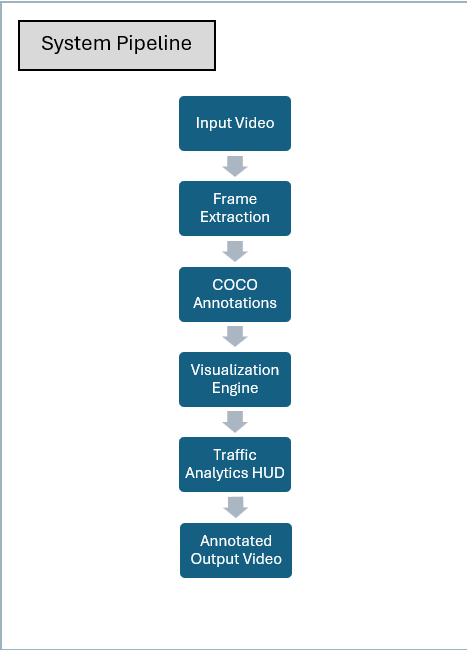

# Urban Traffic Monitoring Demo


## 🎬 Demo

<p align="center">
  
</p>


## Overview

This is a learning project focused on CVAT annotation workflows, COCO dataset processing, and video generation with OpenCV. The application loads annotated frames, visualizes object annotations with custom Python overlays, and generates a labeled output video.


The system processes frames annotated in **COCO format** and produces an output video containing:

- Bounding boxes for detected objects
- Object class labels
- Track IDs
- Lane IDs
- Traffic statistics dashboard (HUD)
- Timestamp overlay

The goal of the project is to simulate a **traffic analytics visualization system** similar to those used in smart city and intelligent transportation applications.
The visualization is based entirely on manual CVAT annotations exported in COCO format.


## System Pipeline




## Example Output


Example frame showing object tracking, lane analytics and traffic statistics HUD.


## Dataset


The project uses extracted video frames from an urban traffic video recorded at a city intersection, and COCO-format annotations.

The original source video used for frame extraction is not included in this repository. 
The processing pipeline operates directly on the provided frames and annotation file.

Video frames were extracted from the source video using OpenCV and saved as sequential JPG images.


Example:

```python
cap = cv2.VideoCapture("video/input.mp4")

frame_id = 0

while True:
    ret, frame = cap.read()

    if not ret:
        break

    cv2.imwrite(
        f"frames/{frame_id:06d}.jpg",
        frame
    )

    frame_id += 1

cap.release()
```


## 📥 Full Video

A full demonstration video is available for download:

[⬇ Download Full Demo Video](output/demo_video.mp4)


## Installation

Clone the repository:
git clone https://github.com/JovanSk/urban-traffic-monitoring.git

cd urban-traffic-monitoring

Install dependencies:
pip install -r requirements.txt


## Usage

Generate the annotated traffic monitoring video:
python scripts/generate_ground_truth_video.py

The output video will be saved to:
output/demo_video.mp4